# Rencana Implementasi: Optimasi Media & Penyimpanan Potret Pernikahan

| Dokumen | Rencana Implementasi Teknis (Technical Implementation Plan) |
|---|---|
| Target | Mengurangi konsumsi storage 85–90%, mempercepat upload 10x, & menjamin kompatibilitas 100% |
| Versi | 1.0 |
| Tanggal | 24 Agustus 2026 |

---

## 1. Executive Summary & Tujuan

### Masalah Saat Ini
* Foto mentah dari smartphone modern (8–15 MB) diunggah tanpa kompresi, menyebabkan kuota 1 GB Free Tier Vercel Blob penuh hanya dalam ~70 foto.
* Galeri memuat foto resolusi penuh untuk kotak grid berukuran 200px, menyedot ratusan megabyte kuota data tamu.
* Format HEIC dari iPhone berisiko tidak tampil di Android atau browser TV pada mode slideshow.

### Target Optimasi
1. **Efisiensi Storage:** Memangkas ukuran rata-rata foto dari **10–15 MB** menjadi **~600 KB – 1.2 MB** (pengurangan ukuran 85–90%).
2. **Kapasitas 1 GB Vercel Blob:** Mampu menampung **1.000 – 1.500+ foto** per event tanpa biaya tambahan.
3. **Kecepatan Upload:** Waktu unggah di jaringan 4G venue turun dari **10–15 detik** menjadi **1–2 detik per foto**.
4. **Kompatibilitas Penuh:** Semua foto otomatis berformat JPEG/WebP standar yang dapat dirender di semua browser, HP Android, iOS, dan Smart TV.

---

## 2. Arsitektur Solusi Teknis

```
[ File Terpilih (Kamera/Galeri Tamu) ]
                 │
                 ▼
       ┌───────────────────┐
       │ Is File Video?    │
       └─┬───────────────┬─┘
         │ (Ya)          │ (Tidak / Image)
         ▼               ▼
  [ Direct Stream ]  [ Image Optimizer Engine ] (Client Canvas)
  [ Multipart >8MB]  ├─ 1. Deteksi format (HEIC/JPEG/PNG)
                     ├─ 2. Auto-orientasi & Resize (Max 2048px)
                     ├─ 3. Kompresi JPEG/WebP (Quality: 0.82)
                     └─ 4. Hasil: Blob (~800 KB)
                                 │
                                 ▼
                 [ Request Scoped Token via API ]
                 [ Direct Upload ke Vercel Blob ]
```

---

## 3. Rincian Fase Implementasi

### Fase 1: Pembuatan Modul Utilitas Kompresi (`src/lib/imageOptimizer.ts`)
Membuat engine kompresi gambar berbasis browser HTML5 Canvas dan Web APIs tanpa membebani bundle aplikasi.

* **Fungsi `compressImage(file: File, options?: CompressionOptions): Promise<File>`**
  * **Dimensi Maksimum:** `2048px` pada sisi terpanjang (resolusi 2K ultra-cukup untuk layar Retina & cetak 4R/A4).
  * **Format Output:** `image/jpeg` dengan kualitas `0.82` (titik manis antara ukuran file sangat kecil dan ketajaman tinggi tanpa artefak kompresi).
  * **EXIF Orientation:** Menggunakan `createImageBitmap` dengan opsi `imageOrientation: 'from-image'` agar foto potret tidak terputar miring.
  * **Fallback Handling:** Jika file adalah GIF, video, atau proses kompresi gagal di browser lama, fungsi mengembalikan file asli secara aman.

---

### Fase 2: Integrasi ke Alur Upload Tamu (`src/UploadFlow.tsx`)
Mengintegrasikan modul optimasi ke dalam alur pemilihan dan pengiriman foto:

1. **Pemilihan File (`addFiles`):**
   * Saat tamu memilih foto, tampilkan pratinjau instan (*instant blob URL preview*).
   * Jalankan kompresi secara asinkron di latar belakang.
   * Perbarui label ukuran file di UI (misal: `14.2 MB` $\rightarrow$ `850 KB (Teroptimasi)`).
2. **Kalkulasi Ukuran Nyata:**
   * Kirim nilai `sizeBytes` yang sudah terkompresi ke endpoint `/api/media/upload-url`.
   * Memastikan token scoped upload dibuat dengan batasan ukuran yang akurat.
3. **Optimasi Foto Sampul Admin (`src/AdminSettings.tsx`):**
   * Terapkan engine yang sama pada foto sampul event agar tidak membuang kuota admin.

---

### Fase 3: Dukungan Format Apple HEIC
Mengatasi masalah foto `.heic` dari perangkat iPhone:

* Deteksi MIME type `image/heic` atau ekstensi `.heic` / `.heif`.
* Manfaatkan native browser decoding via `createImageBitmap` / dynamic import `heic2any` jika diperlukan untuk mengonversi pixel data ke kanvas sebelum diekspor sebagai JPEG standar.
* Menjamin nama file berekstensi `.jpg` sehingga kompatibel 100% di semua platform.

---

### Fase 4: Optimasi Rendering Galeri & Slideshow
Mencegah *browser lag* dan menghemat konsumsi bandwidth saat melihat media:

1. **Galeri (`src/GalleryScreen.tsx`):**
   * Menambahkan atribut `decoding="async"` dan `loading="lazy"` pada elemen ``.
   * Menambahkan placeholder rasio aspek agar layout masonry tidak meloncat (*Cumulative Layout Shift / CLS = 0*).
   * Mengatur `<video preload="metadata">` agar tidak menyedot data video penuh sebelum diklik.
2. **Slideshow Layar Panggung (`src/SlideshowScreen.tsx`):**
   * Preload 1 slide berikutnya di latar belakang (*1-item buffer*) agar transisi crossfade instan tanpa jeda blank hitam.
   * Otomatis membebaskan objek media slide lama dari memori browser (*Garbage Collection friendly*) agar stabil menyala 8 jam penuh di venue.

---

## 4. Jadwal & Urutan Pengerjaan

```mermaid
gantt
    title Roadmap Implementasi Optimasi Media
    dateFormat  X
    axisFormat %s

    section Core Engine
    Image Optimizer Module (imageOptimizer.ts) :active, task1, 0, 1
    HEIC Conversion Support                   :task2, 1, 2

    section UI Integration
    Integrasi UploadFlow.tsx                  :task3, 2, 3
    Integrasi AdminSettings.tsx (Cover Photo) :task4, 3, 4

    section Performance & UX
    Optimasi Galeri & Lazy Decoding           :task5, 4, 5
    Optimasi Slideshow Buffer                 :task6, 5, 6
    Testing & Verifikasi (Network Throttling) :task7, 6, 7
```



---

## 5. Rencana Pengujian & Kriteria Keberhasilan (Acceptance Criteria)

| Skenario Uji | Kondisi Pengujian | Target / Kriteria Sukses |
|---|---|---|
| **Kompresi Foto Kamera HP** | Foto iPhone 15 / Samsung S23 (~12 MB, 48MP) | Berhasil dikompresi menjadi < 1.2 MB sebelum dikirim ke Vercel Blob |
| **Kualitas Visual** | Foto di-zoom di layar HP dan monitor 1080p | Detail wajah, warna, dan gaun tetap tajam, tidak tampak buram/pixelated |
| **Kecepatan Upload 4G** | Jaringan disimulasikan 4G Throttled (2 Mbps upload) | 1 foto selesai terkirim dalam ≤ 3 detik |
| **Kompatibilitas HEIC** | Upload file .HEIC dari Safari iPhone | Tampil dengan normal dan jernih di HP Android & layar Slideshow |
| **Uji Beban Galeri** | Galeri berisi 100 foto dibuka sekaligus | Konsumsi bandwidth < 80 MB, scrolling lancar 60 FPS tanpa patah-patah |

---

## 6. Pertanyaan / Keputusan Terbuka (Open Decisions)

1. **Format Output Default:** Direkomendasikan menggunakan format **`JPEG` kualitas 0.82** karena didukung oleh 100% browser dan perangkat tertua sekalipun (dibandingkan WebP yang pada beberapa Smart TV jadul memiliki kendala decoding).
2. **Dimensi Resolusi:** Maksimum **2048px** (Sisi terpanjang) — memberikan rasio ideal antara ketajaman maksimal dan efisiensi ukuran file.
